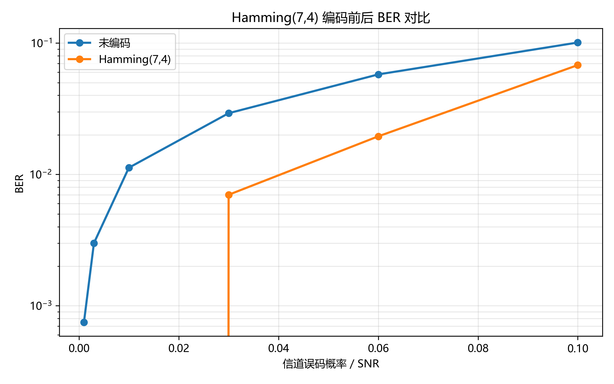
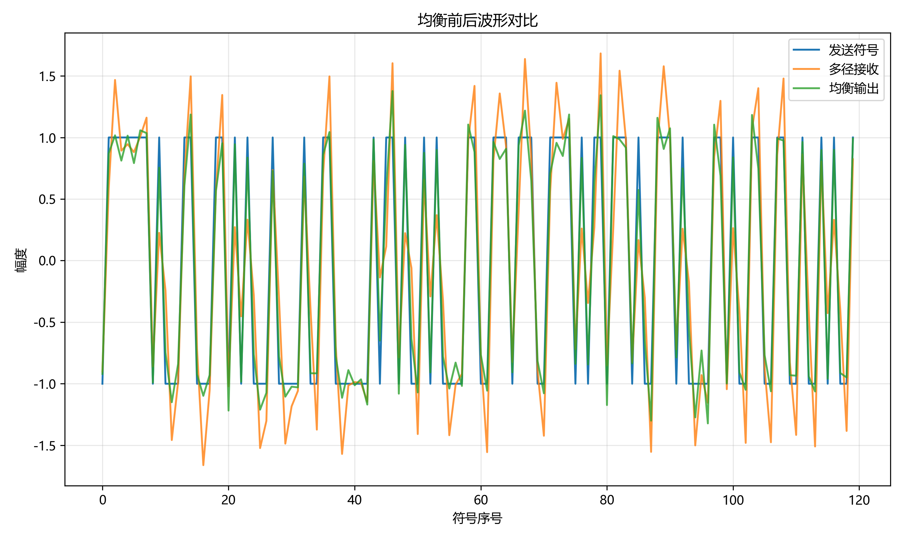
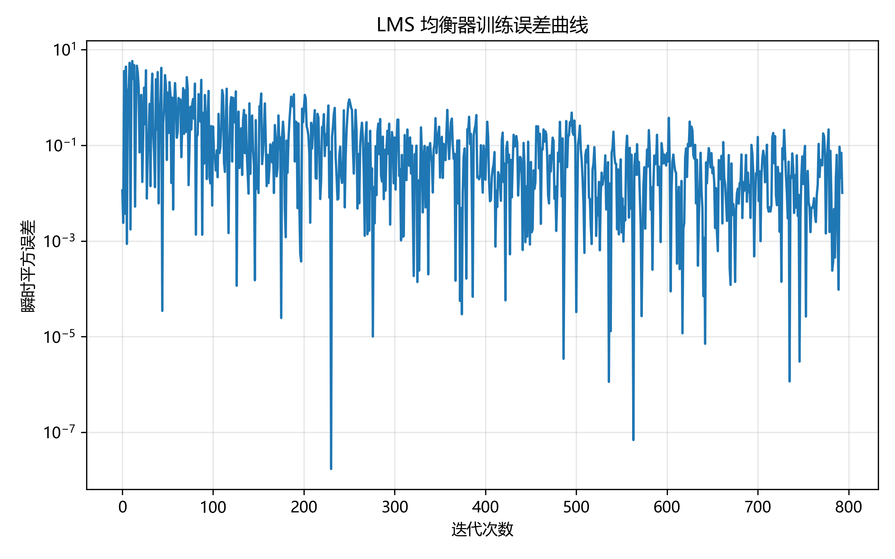

# 无线通信技术实验报告：信道编码与信道均衡

## 1. 实验目的

本实验围绕无线通信系统中的信道编码与信道均衡展开。无线信道中常常存在噪声、多径传播和符号间干扰，这些因素会导致接收端出现误码，从而降低通信系统的可靠性。
通过本实验，希望达到以下目的：
1. 理解信道编码通过增加冗余比特来提高通信可靠性的思想。
2. 掌握 Hamming(7,4) 线性分组码的编码、伴随式计算和单比特纠错方法。
3. 理解多径信道产生符号间干扰 ISI 的原因。
4. 掌握 ZF 迫零均衡器和 LMS 自适应均衡器的基本原理。
5. 能够使用 Python 完成信道编码和信道均衡算法的仿真实现。
6. 能够通过 BER 曲线、均衡波形和误差曲线分析实验结果。
7. 熟悉 GitHub 自动评分和 Pull Request 提交流程。

## 2. 实验原理

### 2.1 信道编码

在无线通信系统中，信号在传输过程中会受到噪声、干扰和信道衰落等影响，接收端得到的比特可能与发送端不同，从而产生误码。信道编码的基本思想是在原始信息比特中加入一定的冗余校验比特，使接收端能够发现甚至纠正部分错误。

本实验中主要使用 Hamming(7,4) 线性分组码。Hamming(7,4) 表示每 4 位信息比特会被编码成 7 位码字，其中多出的 3 位是校验比特。它的编码过程可以表示为：c = uG mod 2。其中，u 表示 4 位信息比特，G 表示生成矩阵，c 表示编码后的 7 位码字，mod 2 表示二进制模 2 运算。

接收端收到码字后，需要判断码字中是否出现错误。Hamming 码通过校验矩阵 H 计算伴随式 syndrome：s = rH^T mod 2。其中，r 表示接收码字，H^T 表示校验矩阵的转置。如果计算得到的 syndrome 为全 0，说明没有检测到错误；如果 syndrome 非 0，则说明接收码字中存在错误。

对于 Hamming(7,4) 来说，如果只发生单比特错误，syndrome 会等于校验矩阵 H 的某一列。因此，可以通过比较 syndrome 和 H 的各列来确定出错位置。找到错误位置后，将该比特翻转，就可以完成单比特纠错。

Hamming(7,4) 能够降低误码率，但它也会引入冗余。因为每 4 位信息比特需要发送 7 位码字，所以码率为：R = 4 / 7。码率降低意味着传输效率下降，但系统的抗误码能力提高了。这体现了信道编码中“用冗余换可靠性”的思想。

如果完成选做部分，还涉及卷积码和 Viterbi 译码。卷积码不是只对固定长度的信息块编码，而是利用当前输入比特和前面若干个历史比特共同决定输出。Viterbi 译码则通过比较不同路径的累计距离，选择最可能的发送比特序列，从而实现对卷积码的译码。
### 2.2 信道均衡

在无线通信中，信号从发射端到接收端往往不只经过一条路径。由于反射、散射和折射等现象，接收端会收到多个延迟不同、幅度不同的信号副本，这种现象称为多径传播。

多径传播会导致一个符号的能量扩展到相邻符号的位置，使相邻符号之间发生相互干扰，这种现象称为符号间干扰，即 ISI。ISI 会使接收端难以准确判断当前符号，从而导致误码率上升。

信道均衡的目的就是在接收端设计一个滤波器，尽可能补偿信道造成的失真，使接收信号恢复得更接近原始发送信号。本实验中主要涉及 ZF 均衡和 LMS 自适应均衡。

ZF 均衡，即迫零均衡。它的目标是设计一个 FIR 均衡器，使信道冲激响应与均衡器冲激响应卷积后的整体响应尽可能接近单位冲激响应：h * w ≈ δ。其中，h 表示信道冲激响应，w 表示均衡器抽头，δ 表示单位冲激响应。如果整体响应接近单位冲激响应，说明相邻符号之间的干扰被尽量消除了。

本实验中，ZF 均衡器通过构造卷积矩阵，将卷积问题转化为线性方程问题：Aw ≈ d。其中，A 是由信道冲激响应构造的卷积矩阵，w 是要求解的均衡器抽头，d 是目标冲激响应。由于实际情况下可能无法完全满足等式，因此使用最小二乘方法求解均衡器抽头。

LMS 均衡，即最小均方自适应均衡。它不需要完全已知信道，而是通过训练序列不断调整均衡器抽头，使均衡器输出逐渐接近期望发送信号。

LMS 算法的基本过程为：
y = w^T x
e = d - y
w = w + μ e x
其中，x 表示当前输入向量，w 表示均衡器抽头，y 表示均衡器输出，d 表示期望输出，e 表示误差，μ 表示步长。

如果步长选择合适，随着训练次数增加，误差会逐渐减小，均衡器输出会越来越接近原始发送符号。LMS 的优点是能够根据训练数据自适应调整参数，但步长过大可能导致发散，步长过小又会导致收敛速度较慢。

## 3. 实验环境

- Python 版本：Python 3.13.5
- 主要依赖：NumPy、Matplotlib、pytest
- AI 助手使用情况：使用chatgpt 5.5 thinking

## 4. 实验方法与步骤

### 4.1 Part 1：信道编码

本部分主要完成 Hamming(7,4) 编码、伴随式计算和单比特纠错译码，补全的函数包括：hamming74_encode(bits)、hamming74_syndrome(codewords)、hamming74_decode(received)。

具体步骤如下：
1、首先在 hamming74_encode(bits) 函数中，将输入的 0/1 比特序列按照每 4 位一组进行划分。
2、使用生成矩阵 HAMMING_G 对每组 4 位信息比特进行矩阵乘法编码。
3、对编码结果进行模 2 运算，得到每组 7 位的 Hamming(7,4) 码字。
4、在 hamming74_syndrome(codewords) 函数中，将输入码字整理成每 7 位一组。
5、使用校验矩阵 HAMMING_H 计算每个码字的伴随式 syndrome。
6、在 hamming74_decode(received) 函数中，先计算接收码字的 syndrome。
7、如果 syndrome 为全 0，则认为没有检测到错误。
8、如果 syndrome 非 0，则将 syndrome 与 HAMMING_H 的各列比较，找到错误比特的位置。
9、找到错误位置后，将对应比特翻转，完成单比特纠错。
10、最后取每个纠错后码字的前 4 位作为恢复出的信息比特。
11、运行测试脚本检查编码、伴随式计算和译码功能是否正确。
12、运行实验脚本生成 Hamming(7,4) 编码前后的 BER 对比曲线。

### 4.2 Part 2：信道均衡

本部分主要完成 FIR 滤波、ZF 迫零均衡器设计和 LMS 自适应均衡器训练，补全的函数包括：estimate_zf_equalizer(channel, num_taps)、apply_fir_filter(signal, taps)、lms_equalizer(rx_train, tx_train, num_taps, step_size)。

具体步骤如下：
1、首先在 estimate_zf_equalizer(channel, num_taps) 函数中，根据给定的多径信道冲激响应构造卷积矩阵。
2、设置目标冲激响应，使信道与均衡器卷积后的整体响应尽量接近单位冲激响应。
3、使用 np.linalg.lstsq 最小二乘方法求解 ZF 均衡器抽头。
4、在 apply_fir_filter(signal, taps) 函数中，使用 np.convolve 对输入信号进行 FIR 滤波。
5、为了使输出信号长度与输入信号一致，取完整卷积结果的前 len(signal) 个样本作为输出。
6、在 lms_equalizer(rx_train, tx_train, num_taps, step_size) 函数中，初始化 LMS 均衡器抽头。
7、从接收训练序列中依次取出长度为 num_taps 的输入向量。
8、计算均衡器输出，并与期望发送符号进行比较，得到误差。
9、根据 LMS 更新公式调整均衡器抽头，使均衡器输出逐渐接近期望发送符号。
10、保存每次迭代的误差，用于绘制 LMS 训练误差曲线。
11、运行测试脚本检查 FIR、ZF 和 LMS 三个函数是否正确。
12、运行实验脚本生成均衡前后波形对比图和 LMS 误差曲线。

## 5. 实验结果

插入结果图：

```markdown



```

## 6. 结果分析与讨论

回答：

1. Hamming(7,4) 为什么能纠正单比特错误？
Hamming(7,4) 在 4 位信息比特之外增加了 3 位校验比特，形成 7 位码字。接收端可以通过校验矩阵计算 syndrome。对于单比特错误，syndrome 会等于校验矩阵 H 的某一列，因此可以根据 syndrome 定位具体出错的位置。找到错误位置后，将对应比特翻转，就可以完成单比特纠错。

2. 为什么信道编码会引入冗余并降低码率？
信道编码为了提高可靠性，需要在原始信息比特之外加入校验比特。以 Hamming(7,4) 为例，每 4 位信息比特会被编码成 7 位码字，其中多出的 3 位就是冗余校验位。因此它的码率为 4/7，小于 1。冗余比特可以帮助接收端检测和纠正错误，但也会降低单位传输比特中真正信息比特所占的比例。

3. ZF 均衡为什么可能放大噪声？
ZF 均衡的目标是抵消信道失真，使信道和均衡器的整体响应接近冲激响应。如果信道在某些频率位置衰落很严重，ZF 均衡器为了补偿这些位置，会使用较大的增益。这样虽然可以抵消信道失真，但同时也可能把噪声一起放大。因此 ZF 均衡在信道存在深衰落时可能导致噪声增强。

4. LMS 的步长过大或过小会出现什么问题？
LMS 算法中的步长决定了均衡器抽头每次更新的幅度。如果步长过大，抽头更新过猛，算法可能不稳定，甚至发散，误差无法下降。如果步长过小，虽然算法比较稳定，但收敛速度会很慢，需要更多迭代次数才能达到较好的均衡效果。因此 LMS 步长需要在收敛速度和稳定性之间折中选择。

5. 均衡前后 ISI 有什么变化？
均衡前，由于多径信道的影响，接收信号中相邻符号会相互叠加，产生明显的符号间干扰，导致波形失真和误码率上升。经过 ZF 或 LMS 均衡后，信道造成的拖尾和相邻符号干扰被部分抵消，接收信号更加接近原始发送符号。从实验结果看，均衡后 BER 降低，说明 ISI 得到了一定程度的抑制。

## 7. 实验心得

通过本次实验，我对信道编码和信道均衡在无线通信系统中的作用有了更加直观的理解。

在信道编码部分，我通过实现 Hamming(7,4) 编码、伴随式计算和单比特纠错，理解了信道编码并不是直接消除信道噪声，而是通过增加冗余校验位，让接收端具有发现和纠正错误的能力。Hamming(7,4) 每 4 位信息比特生成 7 位码字，虽然降低了码率，但提高了系统的可靠性。通过 BER 曲线可以看到，编码后的误码率明显低于未编码情况，这说明信道编码能够有效改善通信质量。

在信道均衡部分，我理解了多径信道会造成符号间干扰，使接收信号不再只与当前发送符号有关，还会受到相邻符号的影响。通过 ZF 和 LMS 均衡器，可以在接收端对信道失真进行补偿，使均衡后的信号更加接近原始发送信号。实验中，LMS 均衡后的 BER 从均衡前的 0.0010 降低到 0.0000，说明均衡器对抑制 ISI 有明显作用。

在编程实现过程中，我进一步熟悉了 NumPy 中矩阵乘法、模 2 运算、卷积、最小二乘求解和自适应迭代更新等操作。通过 pytest 测试，我能够及时发现代码中的维度错误、返回值格式错误和函数逻辑问题。相比只看理论公式，通过代码实现和结果图分析，我对 Hamming 编码、ZF 均衡和 LMS 均衡的工作过程有了更具体的认识。

本实验也让我熟悉了 GitHub 自动评分和 Pull Request 提交流程。实验过程中使用了 AI 助手辅助理解实验原理、分析代码实现思路和整理报告内容。

总体来说，本次实验让我认识到，信道编码和信道均衡是提高无线通信系统可靠性的两类重要方法。信道编码主要从“增加冗余、提高抗错能力”的角度改善误码性能，而信道均衡主要从“补偿信道失真、抑制符号间干扰”的角度改善接收信号质量。两者在无线通信系统中都具有重要作用。

## 8. 参考资料

- 课程课件：第6章 信道编码
- 课程课件：第7章 均衡
